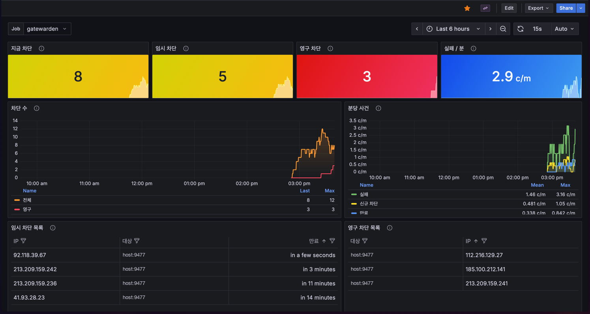

# Gatewarden

Gatewarden follows Linux OpenSSH authentication logs, counts failed logins per remote IP in a rolling window, and blocks repeat offenders with an eBPF/XDP IP map. A block expires after the ban duration. An address that keeps earning bans is blocked permanently.

<p align="center">
  
  <br>
  <em>Who is blocked right now, which bans never expire, and how fast the scanners are failing. The board is <a href="deploy/grafana/gatewarden.json">deploy/grafana/gatewarden.json</a>.</em>
</p>

> Runtime support is Linux-only because enforcement uses eBPF/XDP. Cross-platform build targets are provided, but Windows and macOS binaries cannot enforce firewall bans.

## Build and test

Go 1.26 or newer is required.

```sh
make test
make build-linux
make build-all
make deb
make rpm
```

Install published packages from [https://nexus.manty.co.kr](https://nexus.manty.co.kr). Ubuntu uses the apt repository `apt-hosted` (`stable` `main`). Rocky and RHEL use the yum repository `yum-hosted/gatewarden/`. The first install leaves the service stopped. Steps, including the apt signing key, are in [INSTALL.md](INSTALL.md).

```sh
# Ubuntu
sudo apt update && sudo apt install gatewarden

# Rocky or RHEL
sudo dnf install gatewarden
```

`sudo make install` installs a binary built from this checkout. Docker package builds and Jenkins publishing are also in [INSTALL.md](INSTALL.md).

## Run

eBPF needs an Ethernet ingress interface, Linux XDP BPF-link support (upstream 5.9+), and `CAP_BPF` plus `CAP_NET_ADMIN`. Start with dry-run mode to validate settings without attaching the XDP program:

```sh
sudo ./dist/gatewarden-linux-amd64 -interface eth0 -dry-run -journal-unit ssh
sudo ./dist/gatewarden-linux-amd64 -interface eth0 -journal-unit sshd
sudo ./dist/gatewarden-linux-amd64 -interface eth0 -log-file /var/log/auth.log
```

Before enabling enforcement, add every administrator address or management network to `-allowlist`. The default protects loopback only and cannot infer the IP from which you administer the server. Test the exact service command with `-dry-run` while keeping a second SSH session open.

| Flag | Default | Meaning |
| --- | --- | --- |
| `-log-file` | empty | Follow this file with `tail -F`; when empty, use journald |
| `-journal-unit` | `ssh`, or `GATEWARDEN_JOURNAL_UNIT` | Unit passed to `journalctl -u`. Ubuntu uses `ssh`; Rocky and RHEL use `sshd` |
| `-window` | `5m` | Rolling interval used to count failures |
| `-threshold` | `5` | Failures inside the window before blocking |
| `-ban-duration` | `15m` | How long a temporary block lasts |
| `-permanent-after` | `3`, or `GATEWARDEN_PERMANENT_AFTER` | Temporary bans inside `-permanent-window` that promote the address to a permanent block. `0` disables permanent bans |
| `-permanent-window` | `24h`, or `GATEWARDEN_PERMANENT_WINDOW` | How far back a ban still counts toward a permanent block |
| `-allowlist` | `127.0.0.0/8,::1/128`, or `GATEWARDEN_ALLOWLIST` | Comma-separated IP addresses or CIDRs never blocked |
| `-interface` | `GATEWARDEN_INTERFACE` | Required Ethernet ingress interface for the XDP program |
| `-metrics-addr` | `127.0.0.1:9477`, or `GATEWARDEN_METRICS_ADDR` | HTTP listen address for `/metrics`, `/blocks`, and `/sessions` |
| `-state-file` | `/var/lib/gatewarden/state.json`, or `GATEWARDEN_STATE_FILE` | Permanent bans and recent ban times. Restored after restart |
| `-socket` | `/run/gatewarden/gatewarden.sock`, or `GATEWARDEN_SOCKET` | Unix socket for `blocks`, `sessions`, and `unblock`, mode 0600 |
| `-dry-run` | `false` | Log changes without opening BPF objects |

The service recognizes common OpenSSH failed-password/public-key, invalid-user, PAM authentication-failure, and pre-authentication close records. It also recognizes accepted logins and later disconnects. Duplicate bans are suppressed and expired bans are removed.

## Current blocks and metrics

One ban is counted when an address reaches `-threshold` failures inside `-window`. The same address becomes permanent on the ban that reaches `-permanent-after` bans inside `-permanent-window`. Further failures from a permanently blocked address are ignored. Allowlisted addresses are never banned; an address that was banned before it was allowlisted stays blocked until `unblock`.

`sudo gatewarden blocks` prints the addresses blocked right now. Temporary rows show a UTC expiry. Permanent rows show `permanent` in the `EXPIRES` and `KIND` columns. `sudo gatewarden unblock <ip>` removes the live block, the permanent record, and the strike history, so the address must earn `-permanent-after` bans again. Both commands talk to the mode 0600 socket. The metrics TCP port is read-only.

```sh
sudo gatewarden blocks
sudo gatewarden unblock 203.0.113.10
```

Permanent bans and strike times are stored in `-state-file`. After a restart, permanent bans are inserted into the new XDP map. A restart ends a temporary block immediately, while its strike still counts. When the daemon is stopped, `blocks` and `unblock` read and edit that file directly. `unblock` of an address that is not blocked returns an error.

## Open SSH sessions

`sudo gatewarden sessions` lists SSH sessions open right now: user, source address, client port, process id, and the UTC time the connection started. Use it to look for a session you do not expect.

```sh
sudo gatewarden sessions
```

The command reads the mode 0600 socket and works only while the daemon is running. Sessions are not stored in the state file. On Linux the daemon attaches tracepoints to `accept` and `accept4` in `sshd` and `sshd-session`, then follows the forked process that inherits the socket until that process exits. A session is published after the process has a login uid. The user name comes from that uid. The recorded fields are the user, source address, client port, process id, and start time. Tracepoints report connections that accept after the daemon starts. Processes that already exist at startup are read once from `/proc`. `-dry-run` does not attach tracepoints. Allowlisted addresses are still listed; the allowlist only skips bans.

Authentication failures still come from the journal unit, or from `-log-file`. The follow starts at the end of that stream, so a failure written before startup is not counted.

`GET /sessions` on the metrics address and on the control socket returns the same rows as JSON. `gatewarden_sessions_current` is the number of open sessions. `gatewarden_session_since_seconds{user,ip,port}` is the Unix start time of each one.

Prometheus scrapes `http://127.0.0.1:9477/metrics`. `gatewarden_blocked_current` counts temporary and permanent blocks. `gatewarden_permanent_current` and `gatewarden_permanent{ip="..."}` describe permanent blocks. `gatewarden_block_until_seconds{ip="..."}` is the Unix expiry of each temporary block. `gatewarden_sessions_current` and `gatewarden_session_since_seconds{user,ip,port}` describe SSH sessions open right now. `gatewarden_failures_total`, `gatewarden_blocks_total`, and `gatewarden_unblocks_total` count events since the process started. `gatewarden_unblocks_total` counts expiry only.

[deploy/grafana/gatewarden.json](deploy/grafana/gatewarden.json) is the Grafana dashboard shown above. Import it and choose the Prometheus datasource. The job variable defaults to `gatewarden`. The dashboard includes an open SSH session table; re-import the file to see it. Counters on the dashboard reset when the process restarts.

[deploy/grafana/alerting.yml](deploy/grafana/alerting.yml) provisions three alert rules: the `gatewarden` scrape is down, a permanent block exists, or more than 25 addresses are blocked at once. Each rule notifies the existing contact point `slack-manty-infra`. The file leaves contact points and the default notification policy unchanged. Replace the Prometheus datasource UID before provisioning it on another Grafana.

## systemd

Install the package from Nexus, set `GATEWARDEN_INTERFACE` in `/etc/gatewarden/gatewarden.env`, then start the service:

```sh
sudo systemctl daemon-reload
sudo systemctl enable --now gatewarden
journalctl -u gatewarden -f
```

The packaged unit reads `/etc/gatewarden/gatewarden.env` and passes no interface name of its own. Ubuntu packages default the journal unit to `ssh`. Rocky and RHEL packages default it to `sshd`. Set the interface to the host device, listed by `ip -br link`, before starting. The unit grants `CAP_BPF` and `CAP_NET_ADMIN`, allows unlimited locked memory, and uses a read-only filesystem view. `StateDirectory=gatewarden` and `RuntimeDirectory=gatewarden` provide `/var/lib/gatewarden` and `/run/gatewarden`. The unit restarts after unexpected failures. Packages deliberately do not enable or start Gatewarden. See [INSTALL.md](INSTALL.md).

## eBPF behavior and verification

XDP drops all ingress traffic from blocked IPv4/IPv6 sources on the selected
interface, including traffic for existing sessions and forwarded traffic. It does
not send TCP resets. Other interfaces and inner tunnel headers are not inspected.
Ethernet and up to two 802.1Q/802.1ad tags are supported; non-IP and incomplete
headers pass. Generic XDP is used; no existing XDP program is replaced. Startup
fails if attachment is unavailable.

The unpinned link and map are released when the process exits, including crashes.
Temporary bans end with the process. Permanent bans and the strike times used to
decide them are stored in `/var/lib/gatewarden/state.json` and inserted into the
new map after the next start. The map holds up to 65,536 IPs; insertion failures
are reported rather than silently evicting bans. `-dry-run` validates configuration
without checking kernel support or interface existence.

Run portable checks with `make check` and `make build-all`. On a disposable Linux
host/container with BPF and NET_ADMIN privileges, run:

```sh
GATEWARDEN_TEST_EBPF=1 go test -v -run TestKernel .
# Optional attachment test; use only a disposable Ethernet interface:
GATEWARDEN_TEST_EBPF=1 GATEWARDEN_TEST_INTERFACE=eth0 go test -v -run TestKernel .
```

Dependency rationale: [ADR 001](docs/adr/001-ebpf-firewall.md).

## License

Gatewarden is free software: you can redistribute it and/or modify it under the terms of the GNU General Public License as published by the Free Software Foundation, either version 2 of the License, or (at your option) any later version. See [LICENSE](LICENSE). Change history is recorded in [CHANGELOG.md](CHANGELOG.md).
